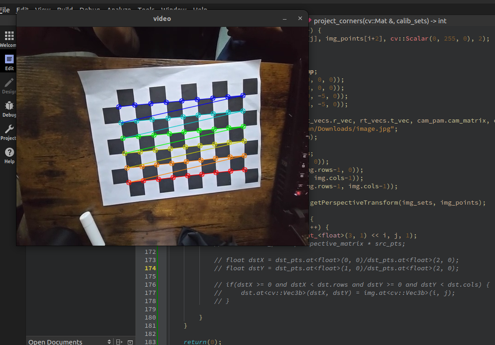
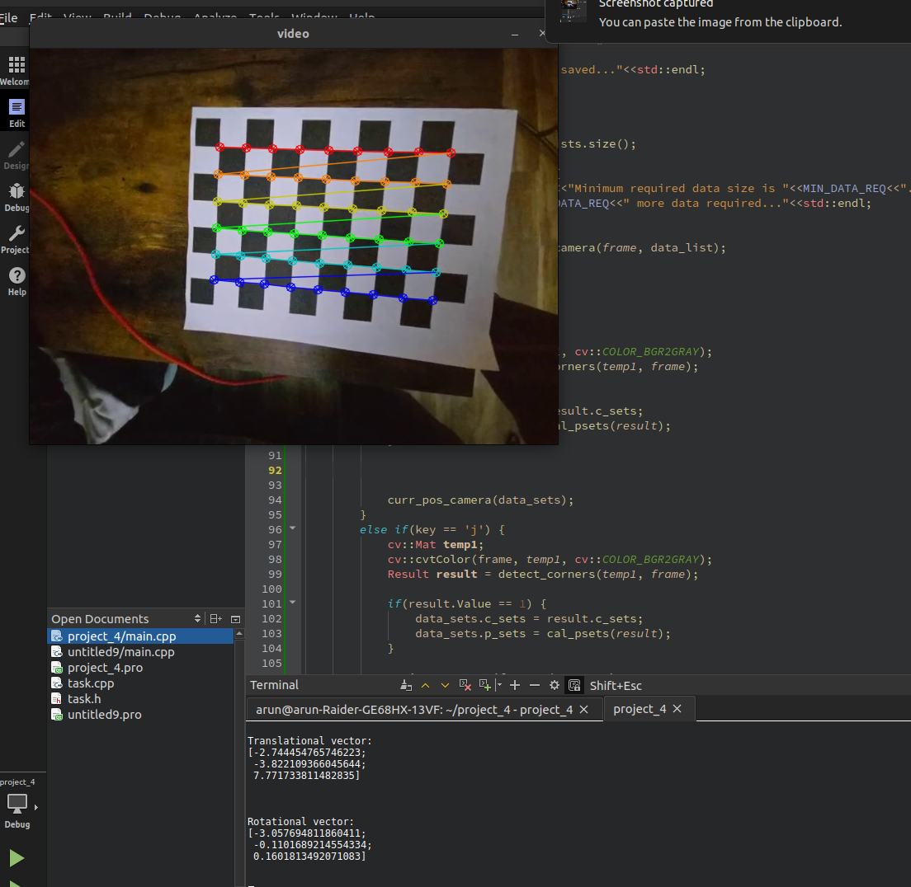
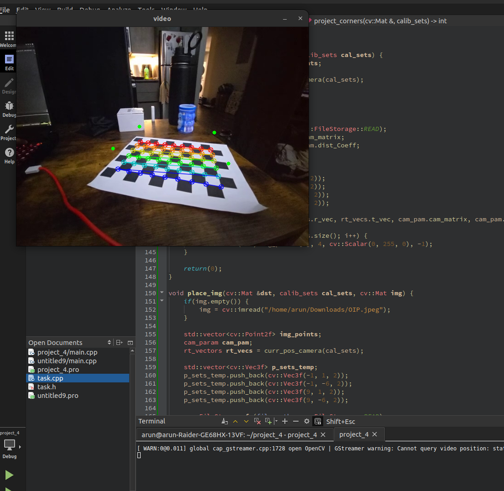
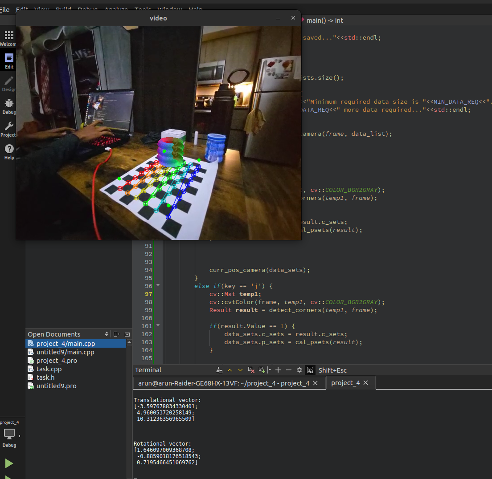
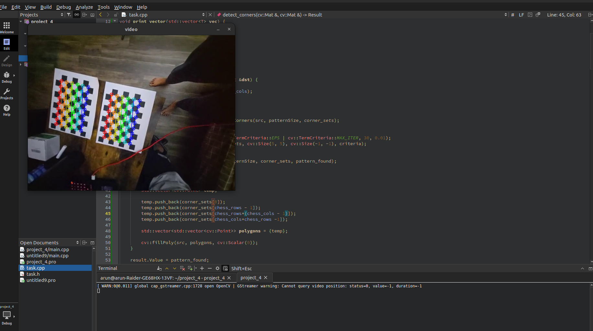
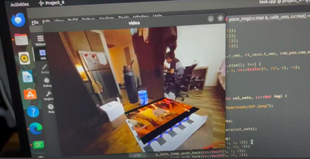
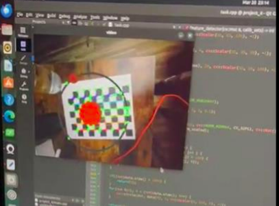

# 3D Pose Estimation & Augmented Reality

## Table of Contents

1. [Introduction](#Introduction)
2. [Installation](#Installation)
3. [Results](#Results)

## Introduction
This project is all about camera calibration and getting to know about virtual objects in a scene and 
generating virtual objects in a scene. The project introduces us to camera calibration techniques and 
the ways to introduces virtual object into the 3D space. It allows us to explore the features of 
OpenCV like drawchessboardcorner, finsdchessboardcorner, CalibratCamera, warperspective, 
getperspective. This project helps us in exploring the features for displaying virtual object in 3D 
space. 

### Development Environment
- **Operating System:** Ubuntu 22.04
- **IDE:**  Qt creator


## Installation
### 1. Cloning the project
```
   https://github.com/ARUNSRINIVASAN12/3D-Pose-estimation-Augmented-Reality-.git
   cd /project location
```

### 2. Install C++ Compiler
   
  You need a C++ compiler installed on your system to build and run this project. If you don't have one installed, follow the instructions below:

  * **Windows:** Install MinGW or Visual Studio with C++ development tools.
  * **Mac:** Install Xcode command-line tools or GCC through Homebrew.
  * **Linux:** Install GCC through your package manager (e.g., `sudo apt install g++` on Ubuntu).
  
### 3. Setup Visual Studio Code \
Visual Studio Code is a lightweight but powerful source code editor that runs on your desktop. To set up Visual Studio Code for C++ development:

1. Download and install Visual Studio Code.
2. Install the C/C++ extension by Microsoft from the Extensions view (`Ctrl+Shift+X`).
3. Open your project folder in Visual Studio Code.

### 4. OpenCV Installation (Pre-configured OpenCV for Python and C++ from GitHub releases)
1. Download opencv-4.5.1-vc14_vc15.exe from the latest release: https://github.com/opencv/opencv/releases/tag/4.5.1
2. unpack to C:\opencv
3. edit environment variables. Win search "Environment variables"
4. append to Path the path to OpenCV: C:\opencv\bin
5. restart computer
6. open cmd
7. `echo %Path%` output should contain a new path

## Results


<p align="center"><em> Fig 1. Chessboard with detected corners. </em></p>



<p align="center"><em> Fig 2. Calibrated camera. </em></p>



<p align="center"><em> Fig 3. Project Outside 3D Corners. </em></p>



<p align="center"><em> Fig 4. Creating a Virtual Object (Augmented Reality). </em></p>



<p align="center"><em> Fig 5. Detecting multiple Chessboard. </em></p>



<p align="center"><em> Fig 6. Playing video sequence on to the virtual object. </em></p>



<p align="center"><em> Fig 7. Creating a moving object (Planetary system) on to the virtual object. </em></p>
